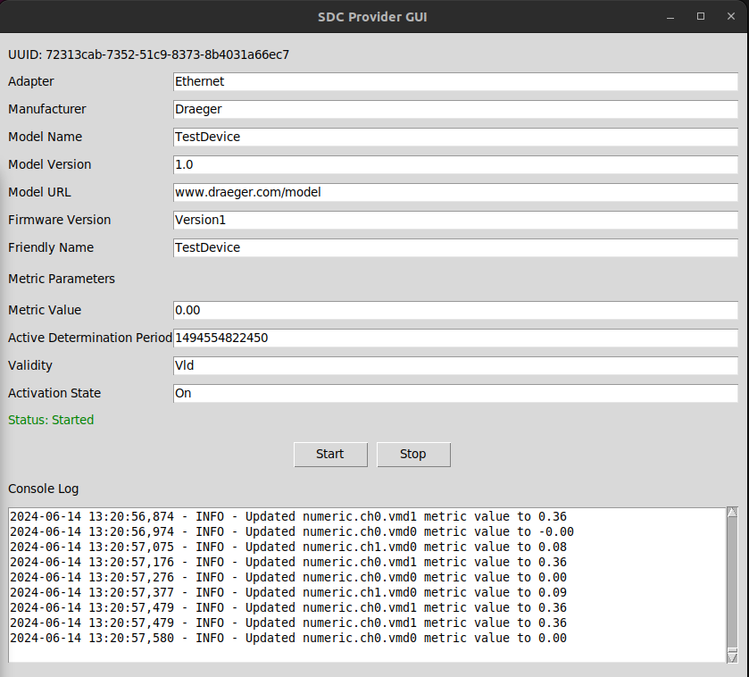
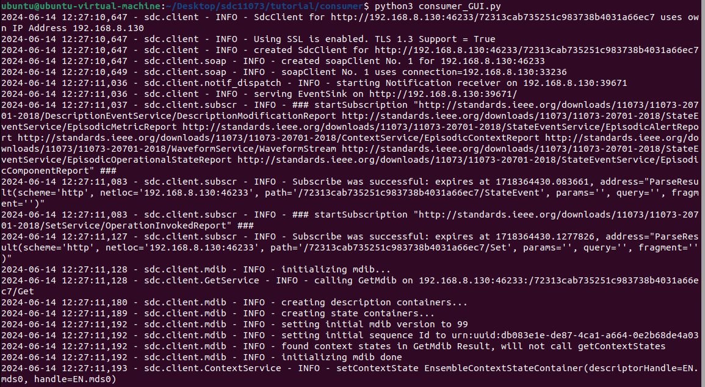

# SDC Client and Provider GUI

This project provides a graphical user interface (GUI) for both an SDC (Service-Oriented Device Connectivity) provider and a client. The provider simulates an SDC device, while the client connects to and retrieves data from an SDC device. The GUIs are built using `tkinter` and support real-time data visualization using `matplotlib`.

## Table of Contents

1. [Prerequisites](#prerequisites)
2. [Installation](#installation)
3. [Usage](#usage)
4. [Configuration](#configuration)
5. [Execution](#execution)
6. [Details on Functionality](#details-on-functionality)
7. [Screenshots](#screenshots)

## Prerequisites

### Python Packages

Ensure you have Python 3.8 or later installed. You need the following Python packages:

- `tkinter`: For building the GUI.
- `matplotlib`: For plotting data.
- `pillow`: For handling images (used for icons and graphics in the GUI).
- `neurokit2`: For simulating physiological signals.
- `sdc11073`: For interacting with SDC devices.

### System Packages

- On Ubuntu, you might need additional system libraries for `tkinter`:
  ```bash
  sudo apt-get install python3-tk
  ```

## Installation

1. **Clone the Repository**
   
   ```bash
   git clone https://github.com/wollooo/sdc11073/tree/GUI.git
   cd sdc11073
   ```

2. **Set Up a Virtual Environment (Optional but recommended)**

   ```bash
   python3 -m venv venv
   source venv/bin/activate  # On Windows, use `venv\Scripts\activate`
   ```

3. **Install Required Packages**

   ```bash
   pip install tkinter matplotlib pillow neurokit2 sdc11073
   ```

## Usage

### SDC Provider GUI (`sdc_provider_gui.py`)

The SDC provider GUI simulates an SDC device that generates physiological signals and updates metrics.

1. **Configure the Provider**

   Optional: Modify the following details in the GUI or pyhtonfile:
   - Adapter (default: `Ethernet`)
   - Manufacturer (default: `Draeger`)
   - Model Name (default: `TestDevice`)
   - Model Version (default: `1.0`)
   - Model URL (default: `www.draeger.com/model`)
   - Firmware Version (default: `Version1`)
   - Friendly Name (default: `TestDevice`)
   - Initial Metric Value (default: `0.0`)
   - Active Determination Period (default: `1494554822450`)
   - Validity (default: `Vld`)
   - Activation State (default: `On`)

2. **Start the Provider**

   Click the "Start" button to simulate the device. Logs will appear in the console section of the GUI.

3. **Stop the Provider**

   Click the "Stop" button to terminate the simulation.

### SDC Client GUI (`sdc_client_gui.py`)

The SDC client GUI discovers and connects to SDC devices, retrieving metrics and visualizing them.

1. **Configure the Client**

   There is no direct configuration for the client via GUI. It will automatically search for available devices/providers based on the UUID on the network.

2. **Start the Client**

   Click the "Run" button to start the client. It will display device information and real-time metrics in the console and plots.

3. **Stop the Client**

   Click the "Stop" button to disconnect and stop retrieving metrics.

## Configuration

### Connection Configuration

The SDC Client will automatically search for SDC devices using WS-Discovery over the preconfigured "Ethernet" network interface. Ensure your devices and the client are on the same network and can communicate via WS-Discovery.

### MDIB Configuration for Provider

The provider uses an MDIB (Medical Device Information Base) file named `mdib.xml`. Ensure this file exists in the project directory with valid device descriptions.

### Logging and Data Visualization

Logs from both the client and provider are shown in the GUI. The provider simulates data using `neurokit2`, and the client visualizes this data using `matplotlib`.

## Execution

### Running the SDC Provider GUI

1. **Execute the Script**

   ```bash
   python3 sdc_provider_gui.py
   ```

2. **Follow the Configuration and Usage Instructions**

   Configure the provider using the GUI and start the simulation.

### Running the SDC Client GUI

1. **Execute the Script**

   ```bash
   python3 sdc_client_gui.py
   ```

2. **Follow the Configuration and Usage Instructions**

   Run the client using the GUI to discover and visualize data from SDC devices.

## Details on Functionality

### `sdc_provider_gui.py`

- **Simulates SDC Device**: Uses `neurokit2` to generate ECG, respiratory, and EMG signals.
- **Updates Metrics**: Sends simulated metrics to connected clients.
- **GUI**: Built using `tkinter` with fields for device configuration and a console for logs.

### `sdc_client_gui.py`

- **Discovers SDC Devices**: Uses WS-Discovery to find SDC devices on the network.
- **Retrieves Metrics**: Connects to discovered devices and retrieves metric updates.
- **Visualizes Data**: Plots real-time metrics using `matplotlib` and updates a console with received data.

### Common Components

- **Queue for Data**: Both GUIs use a queue to handle data updates between threads and the main GUI thread.
- **Threading**: The client and provider run in separate threads to keep the GUI responsive while performing network and data processing tasks.
- **Matplotlib Integration**: `matplotlib` is used for data visualization, embedded in the `tkinter` GUI using `FigureCanvasTkAgg`.

## Screenshots

### SDC Provider GUI

This screenshot shows the SDC Provider GUI. It allows configuration of the simulated SDC device's details, such as manufacturer, model name, firmware version, and initial metric values. Logs for the provider are displayed in the console log section at the bottom.



### SDC Consumer Command Line Output

This screenshot shows the command line output for the SDC Consumer script. It logs the connection and subscription details of the SDC Client.



### SDC Consumer GUI

This screenshot shows the SDC Consumer GUI. It includes real-time plots for three data streams (Data1 = EMG signal, Data2 = respiratory signal, and Data3 = EMG signal) and a console for updates.


## Notes

- **Error Handling**: Basic error handling is included. Ensure proper network setup for discovery and communication.
- **Dependencies**: Make sure all dependencies are correctly installed and the environment is properly configured.

For further questions or issues, please refer to the repository's issue tracker or contact the maintainer.
